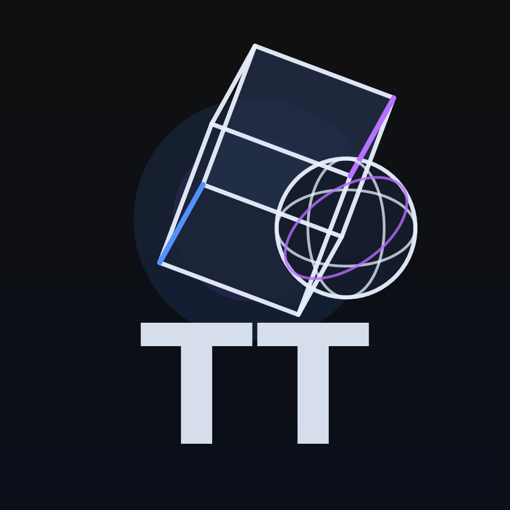

<p align="center">
  
</p>

https://github.com/user-attachments/assets/8e1a8892-ae9b-4781-914b-f22dc963aac1

````md
# TT — 3D Instances (Expo + React Three Fiber)

A small Expo (SDK 54) app that renders interactive 3D instances (boxes & spheres) using **React Three Fiber** on React Native.  
It supports **camera orbit controls**, **instance selection + highlight**, **spawn animations**, and **persistent state** (Zustand + AsyncStorage).

---

## ✨ Features

- Generate random 3D instances (box / sphere) with:
  - random color
  - random scale
  - random rotation
  - deterministic spawn distribution (golden spiral) to reduce overlap
- Tap an object to select it (highlight + subtle scale feedback)
- Camera controls:
  - rotate + pinch-to-zoom (OrbitControls)
- Smooth animations with `@react-spring/three`
- State management with Zustand
- Persisted state via AsyncStorage (instances survive reloads)

---

## 🧱 Tech Stack

- Expo SDK 54 + TypeScript
- `expo-gl`
- `three`
- `@react-three/fiber/native`
- `@react-three/drei/native`
- `r3f-native-orbitcontrols`
- `zustand` (+ `persist` + AsyncStorage)
- `@react-spring/three`

---

## ✅ Requirements

- Node.js (LTS recommended)
- npm

---

## 🚀 Getting Started (from scratch)

### 1) Clone

```bash
# HTTPS
git clone https://github.com/oswaldoAlvarez/TT.git

# OR SSH (recommended if you have SSH keys configured)
git clone git@github.com:oswaldoAlvarez/TT.git

cd TT
````

### 2) Install dependencies

```bash
npm install
```

---

## ▶️ Run with Expo Go (fastest)

### 1) Start Metro

```bash
npx expo start --clear
```

### 2) Open on a device

* Install **Expo Go** from the App Store / Google Play.
* Make sure your computer and phone are on the same Wi-Fi.
* Scan the QR code shown in the terminal/browser.

If your network blocks LAN discovery:

```bash
npx expo start --tunnel
```

---

## 📱 Run on a Physical Device

### Option A — Expo Go (easiest)

Same as “Run with Expo Go”:

```bash
npx expo start --clear
```

---

## 🧰 Useful Commands

```bash
npx expo start
npx expo start --clear
```

---

## 🧯 Troubleshooting

### “I don’t see the scene / it’s slow on iOS simulator”

The iOS simulator can be significantly slower for GL rendering than a real device.
This project uses `frameloop: 'demand'` plus throttled invalidation to keep it responsive.

### “Expo asks me to pick a simulator/device each time”

That can happen after running `expo run:*` or when multiple simulators/emulators are available.
Launch a simulator/emulator first, then press `i`/`a`, or select the target when prompted.

### “Network QR doesn’t work”

Try:

```bash
npx expo start --tunnel
```
